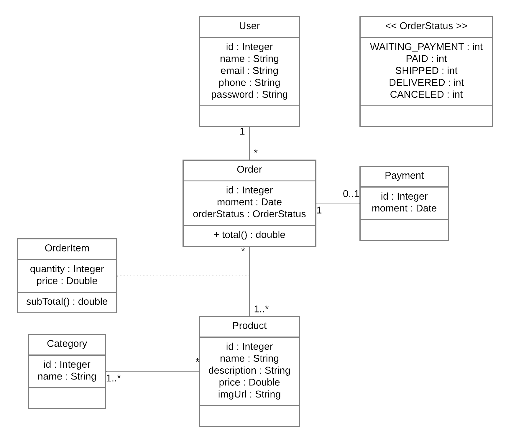
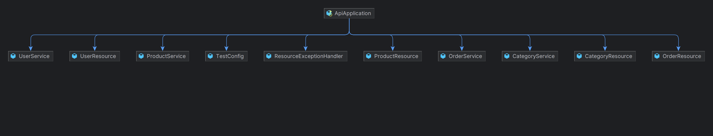

# Spring Boot 3 - JPA - Swagger » API


<p align="center">
    
</p>


> Este projeto foi desenvolvido em um ambiente de estudo, abordando conceitos de gerenciamento de usuãrios, pedidos e produtos.
 


 ## 💻 Tecnologias utilizadas
 - Spring Boot 3
 - JPA
 - PostgreSQL

## ✅ Pré-requisitos

Antes de começar, verifique se você atendeu aos seguintes requisitos:

- Ter o `JAVA 17` instalado
- Máquina `<Windows (WSL) / Linux / Mac>`
- PostgreSQL em localhost
- Opcional: Ter o Maven instalado para rodar a aplicação

## ⚙️ Testando o projeto

Para testar o projeto, siga estas etapas:


```
git clone https://github.com/rafs-m1ke/workshop-springboot3-jpa.git
```
```
cd workshop-springboot3-jpa
```
```
cd workshop-springboot3-jpa
```
```
mvn spring-boot:run
```

A partir do endereço `localhost:8080` (Postman - Insomnia) ou `localhost:8080/swagger-ui.html` (Swagger), ẽ possivel executar os testes.


## 📫 Contribuição é sempre bem-vinda! 

Para contribuir, siga estas etapas:

1. Bifurque este repositório.
2. Crie um branch: `git checkout -b <nome_branch>`.
3. Faça suas alterações e confirme-as: `git commit -m '<mensagem_commit>'`
4. Envie para o branch original: `git push origin <nome_do_projeto> / <local>`
5. Crie a solicitação de pull.

Como alternativa, consulte a documentação do GitHub em [como criar uma solicitação pull](https://help.github.com/en/github/collaborating-with-issues-and-pull-requests/creating-a-pull-request).


## 📝 Licença

Esse projeto está sob licença. Veja o arquivo [LICENÇA](LICENSE.md) para mais detalhes.